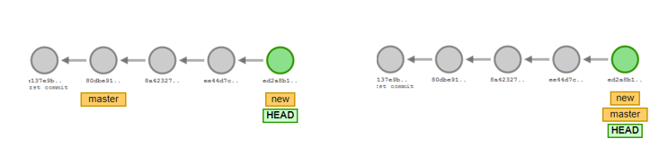

# 협업하기

시작 설정: push는 권한이 필요함: setting > collaborations


## branch

>새로운 가상 세계를 만들어, __여러 개발자__들이 __동시__에 다양한 __작업__을 할 수 있게 만들어 주는 기능이다. 각각의 브랜치는 다른 브랜치의 영향을 받지 않기 때문에, 여러 작업을 동시에 진행할 수 있다.


- `git branch [브랜치이름]`: 브랜치 생성
- `git switch [브랜치이름]`: 해당 브랜치로 이동
  - `git switch -c [브랜치이름]`: 브랜치 생성과 동시에 이동
- `git merge [병합할 브랜치]`: 현재 세계로 세계를 병합
  - `git merge [병합할 브랜치] --no-ff`: fast-forward 없이 병합
- `git branch -d [브랜치이름]` : 브랜치 삭제


## Merge 시나리오

#### 1. Fast Forward Merge

브랜치 분기가 일어났지만, merge 시점에서 branch 한쪽에서만 commit들이 쌓여 있는 경우

(ex. new에만 commit이 있고, master에는 없었을 때)




#### 2. Auto-merge

merge 시점에 양쪽 브랜치에 commit들이 쌓여 있지만, conflict가 발생하지 않는 경우

- merge시 esc세번누른 후 `:wq`를 입력하자


#### 3. Merge conflict 발생

merge 시점에 양쪽 브랜치에 commit들이 쌓여 있고, conflict가 발생하는 경우

- 동일 파일 내에 상충하는 내용이 있을 경우 발생
- 메모장에서 충돌부분을 직접 수정한 후 저장  > commit하면 자동으로 merge됨
- commit 메시지는 다음과 같이 입력하자

```shell
$ git commit -m "Resolve merge conflict"
```


